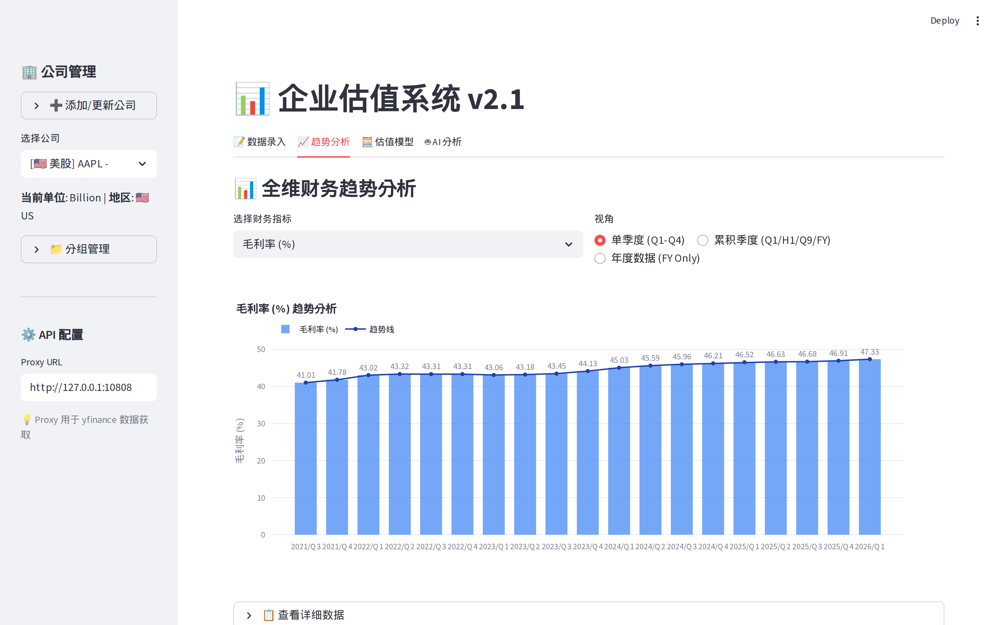
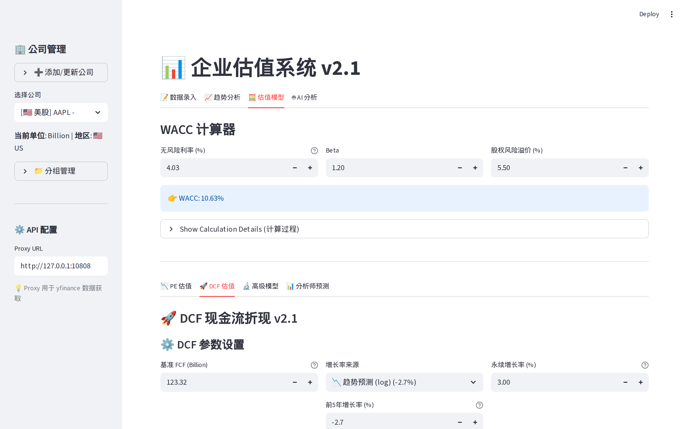

# 📈 Stock-Ward

[](https://www.python.org/downloads/)
[](https://opensource.org/licenses/MIT)
[](./README/updates.md)

[English] | [简体中文](./README/README_ZH.md)

**Your Elegant, High-Performance Quantitative Investment & Valuation Dashboard**

Stock-Ward is a professional-grade financial analysis workspace meticulously crafted with Python and Streamlit. It streamlines the entire value investing workflow—from effortlessly fetching global market data and intelligently normalizing financial statements, to applying rigorous valuation models like PE Bands and DCF.

Discover undeniably undervalued assets through a data-driven, beautifully visualized experience.

---

## 📸 Glimpse Inside

|                  Dashboard Overview                   |                  Valuation Modeling                   |
| :---------------------------------------------------: | :---------------------------------------------------: |
|  |  |

> _Transform complex financial data into clear, actionable insights._

---

## ✨ Why Choose Stock-Ward?

### 🌍 Global Market Coverage

Seamlessly manage and analyze companies across major global markets with automatic currency handling and unit conversion (Billion/Million).

- **US** (🇺🇸 United States)
- **CN** (🇨🇳 China A-Shares)
- **HK** (🇭🇰 Hong Kong)
- **JP** (🇯🇵 Japan)
- **TW** (🇹🇼 Taiwan)

### 🧠 Intelligent Data Engine

- **Cumulative to Single Quarter (SQ)**: Our built-in algorithm automatically decrypts cumulative financial reports (e.g., Q3 YTD) into discrete single-quarter metrics for precise trend analysis.
- **Smart Backfilling**: Powered by `yfinance`, the system automatically fetches and aligns historical market caps and stock prices based on actual report dates.

### 📊 Comprehensive Valuation Toolkit

- **PE Band Analysis**: Visualize historical PE ratios with standard deviation bands and percentile rankings to instantly judge current valuation levels.
- **Discounted Cash Flow (DCF)**: Features an automated WACC calculation module, flexible growth and terminal value assumptions, and supports both TTM (Trailing Twelve Months) and FY (Fiscal Year) projections.
- **Advanced Insights**: Dive deeper with PEG Ratio analysis, ROIC/ROE quality assessments, and track analyst consensus.

### 📈 Interactive Visualizations

- Leverage dynamic, responsive charts powered by Plotly to analyze Revenue, Net Income, Margins, and Cash Flow trends over time.

---

## 🛠️ Built With

- **[Streamlit](https://streamlit.io/)**: Delivering a responsive, interactive, and beautiful web UI.
- **[Pandas](https://pandas.pydata.org/)**: The powerhouse for heavy financial data manipulation.
- **[SQLite](https://www.sqlite.org/)**: A lightweight, serverless database keeping your data local and secure.
- **[yfinance](https://github.com/ranarousset/yfinance)**: Ensuring reliable, real-time market data access.

---

## 🚀 Getting Started

Begin your quantitative journey in just a few steps:

### Prerequisites

- Python 3.8 or higher
- Git

### Installation

1. **Clone the repository**

   ```bash
   git clone https://github.com/Seanyim/Stock-Ward.git
   cd Stock-Ward
   ```

2. **Install dependencies**

   ```bash
   pip install -r requirements.txt
   ```

3. **Launch the application**

   ```bash
   streamlit run main.py
   ```

4. **Explore the dashboard**
   Open your browser and navigate to `http://localhost:8501`.

---

## 📖 How to Use

Follow this simple workflow to evaluate your next investment:

1. **Add a Company** 🏢
   Navigate to the sidebar, enter the ticker (e.g., `AAPL`, `600519.SS`, `9988.HK`), select the region and unit, and click "Add/Update Company".

2. **Input Financials** 📝
   Head to the **"Data Entry"** tab to input historical financial data. The system handles the heavy lifting of fetching relevant market prices.

3. **Analyze Trends** 📉
   Switch to the **"Trend Analysis"** tab to uncover growth rates, margins, and identify cyclicality through clear visualizations.

4. **Determine Intrinsic Value** 🧮
   Use the **"Valuation Models"** tab to run DCF or PE scenarios. Adjust parameters to stress-test your assumptions and find a fair value.

---

## ⚙️ Configuration

- **Proxy Settings**: Need to bypass regional restrictions for Yahoo Finance? Easily configure a proxy URL in the sidebar (default is `http://127.0.0.1:10808`).

---

## 📄 License

This project is licensed under the MIT License - see the [LICENSE](LICENSE) file for details.
